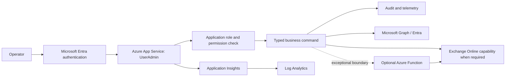

# Azure-Native UserAdmin Target Architecture

## Goal
Deliver UserAdmin as an Azure-native ASP.NET Core application for Entra and Microsoft 365 user administration. The target is not a lift-and-shift of the current PowerShell runner. It is a typed, auditable set of business operations.

## Target Request Path

## Separation of Responsibilities

### Control Plane
- App Service hosts the authenticated MVC UI and application APIs.
- Microsoft Entra ID authenticates operators.
- Application authorization maps Entra roles/groups to explicit permissions.
- Typed commands validate business inputs, enforce confirmation/approval rules, and emit audit events.
- Application Insights and Log Analytics provide request, dependency, failure, and operational telemetry.
- GitHub Actions validates changes and, in a later approved deployment increment, uses OIDC federation to deploy without publish-profile secrets.

### Resource Operations
- `IUserDirectory` queries and updates Entra user data through Microsoft Graph where supported.
- `IUserProvisioningService` orchestrates approved identity creation and onboarding.
- `ILicensingService` manages tenant-approved license/group assignment paths.
- `IMailboxService` isolates Exchange Online-specific actions when they cannot be expressed through Graph.
- An optional Azure Function is a narrow privileged execution boundary for a demonstrated Exchange Online-specific need, not a generic script host.
- Managed identity or federated workload identity receives only the permissions required by each operation.

## Proposed Application Boundaries

| Boundary | Responsibility |
| --- | --- |
| `IUserDirectory` | Search, fetch, and update the Entra user profile needed by approved operations. |
| `IUserProvisioningService` | Coordinate validated identity creation, naming policy, onboarding, and outcome reporting. |
| `ILicensingService` | Apply approved licensing/group rules independently of account creation. |
| `IMailboxService` | Perform only necessary Exchange Online operations behind a typed interface. |
| `IDeletionWorkflowService` | Manage mark, review, retention, approval, and deletion lifecycle. |
| `IUserNotesService` | Own notes only after storage, privacy, retention, and access model are approved. |
| `IAuthorisationService` | Resolve permissions from Entra claims/roles/groups and enforce operation-specific policies. |
| `IAuditService` | Record actor, command, target, decision, outcome, correlation ID, and safe metadata. |

The exact names are illustrative; the boundary principle is required: user journeys call typed business services, not arbitrary scripts.

## Authentication and Authorization

The current `Authorization:AllowedUsers` Windows-domain list is transitional technical debt. Initial target roles should be minimal:

| Role | Initial scope |
| --- | --- |
| `UserAdmin.Reader` | Search and view approved user details. |
| `UserAdmin.Operator` | Reader permissions plus approved non-destructive update/provisioning operations. |
| `UserAdmin.DestructiveOperator` | Explicit approval to perform deletion lifecycle transitions and destructive actions, with confirmation and audit. |
| `UserAdmin.Administrator` | Manage application role assignments/configuration only where separation-of-duties permits. |

Use Entra app roles or groups mapped to application permissions. Do not equate authentication with authorization. Destructive operations require a distinct role, explicit confirmation, target review, idempotency/retry design, and durable audit evidence.

## Identity and Secret Principles
- App Service managed identity is preferred for Azure resource access.
- Graph application permissions must be minimized, consented, reviewed, and separated by operation where practical.
- GitHub Actions uses OIDC federation scoped to repository, branch/environment, and deployment target.
- Key Vault is used only for secrets/certificates that cannot be eliminated; references are preferred over copying secrets into application settings.
- Avoid stored service-account passwords, publish profiles, and long-lived deployment tokens.

## Security Assessment

The target should retire these current-state risks:
- generic script exposure as an application feature;
- privileged child-process execution under a host account;
- identity coupled to the Windows host process;
- domain-joined host and AD/Exchange snap-in dependency;
- plaintext generated-password disclosure;
- broad script-level permissions;
- weak business-operation auditability.

New cloud risks need explicit controls:
- excessive Graph application permissions: least privilege, permission review, separation of duties, and tenant approval;
- over-privileged managed identity: dedicated identities and narrowly assigned roles;
- insufficient operator authorization: app roles and command-level policies;
- destructive actions without confirmation/audit: two-step confirmation, audit, retention and recovery policy;
- workload identity misuse: OIDC subject/audience/environment restrictions and credential monitoring;
- unnecessary secrets: eliminate first, then use Key Vault references.

## Migration Strategy

Use a strangler migration. Keep legacy behavior available only while a typed replacement is validated; remove individual legacy routes after their business replacement and acceptance criteria are approved.

1. Foundation (safe): document tenant authority, data ownership, retention, role owners, naming/UPN policy, licensing, mailbox requirements, and destructive-action governance.
2. Platform foundation (safe): move to .NET 10 LTS, establish App Service-ready configuration, Application Insights/Log Analytics, OIDC CI/CD design, and security baselines. No production provisioning in this step.
3. Entra authentication/authorization (safe): replace Windows Negotiate and allow-list with Entra authentication and Reader/Operator/DestructiveOperator policies.
4. Graph connectivity (safe): introduce managed workload identity, permission review, typed Graph client boundary, safe logging, and contract tests.
5. Read-only search and user details (safe): replace AD-backed search/details with `IUserDirectory`; retain old route only until accepted.
6. Notes and deletion-state design (mutating after approval): decide storage/lifecycle; introduce typed mark/unmark workflow with audit.
7. Cloud-native mutations (mutating): implement approved profile updates, manager, groups, and licensing as independent commands with least privilege.
8. User provisioning (mutating): implement `CreateUser` as a composed workflow with approved onboarding and mailbox behavior; no plaintext password return by default.
9. Deletion workflow (destructive): implement review, retention, confirmation, authorization, audit, recovery/retention and deletion semantics before enabling destructive execution.
10. Remove generic PowerShell runner and demo scripts (safe after replacements): delete Script List and legacy process execution only after required typed journeys are complete.
11. Azure deployment (controlled): provision and deploy only through a separately approved Azure delivery increment.
12. Production hardening (controlled): operational alerts, access reviews, penetration testing, backup/recovery evidence, and runbooks.

## Unresolved Decisions
- Is Entra ID authoritative for all users, or are synchronization/identity-source constraints still present?
- Which user properties and search semantics must be retained, and which are confidential?
- What replaces `extensionAttribute3` and `info` for deletion status and notes, including retention, legal hold, and audit requirements?
- What is the approved deletion outcome: disable, remove licenses, remove mailbox, soft delete, hard delete, or an external HR-driven workflow?
- How are licenses assigned: direct licenses, groups, entitlement management, or another governed process?
- Does mailbox provisioning require Exchange Online-specific behavior, and what supported API/administration path is approved?
- What onboarding mechanism replaces plaintext password delivery?
- Which Entra roles/groups are owned by whom, and what approval is required for destructive operations?
- Which tenant permissions can be granted to a managed workload identity, and should distinct identities be used for reader, operator, and destructive boundaries?
