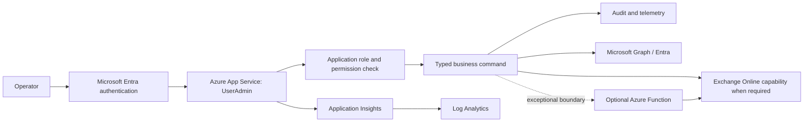

# UserAdmin Future Target Architecture

## Scope and Horizon
This document defines the strategic successor architecture, not the immediate delivery platform. UserAdmin is expected to be relatively short-lived in its present form. The tactical objective is to complete, harden, deploy, and support the current hybrid process on CCCS923/Nutanix. The strategic objective is to replace that process when the organisation's identity and infrastructure architecture permits it.

## Current Tactical Architecture

```text
Service Desk operators
    -> UserAdmin
    -> CCCS923 / Nutanix VPC
    -> current AD / Hybrid Exchange dependencies, including current Exchange Hybrid capability on CCCS653; exact dependency path to be validated
```

The tactical architecture supports the current hybrid identity operating model. It should receive functional proof, security hardening, operational logging, dependency validation, controlled deployment, UAT, and a support/runbook baseline. No assumption should be made that the tactical host or generic script architecture is the strategic successor.

## Strategic Successor Architecture

The strategic successor is an Azure-native ASP.NET Core application for Entra and Microsoft 365 user administration. It is not a lift-and-shift of the current PowerShell runner; it is a typed, auditable set of business operations.

Revisit this architecture when one or more of these trigger conditions are met:
- Entra cloud-only transition is approved and operationally viable.
- The current hybrid identity architecture is retired or materially changed.
- The Nutanix/VPC platform transitions to a new infrastructure model.
- The current Exchange Hybrid capability on CCCS653 is removed or materially changed.

## Strategic Request Path



## Strategic Separation of Responsibilities

### Control Plane
- App Service hosts the authenticated MVC UI and application APIs.
- Microsoft Entra ID authenticates operators.
- Application authorization maps Entra roles/groups to explicit permissions.
- Typed commands validate business inputs, enforce confirmation/approval rules, and emit audit events.
- Application Insights and Log Analytics provide request, dependency, failure, and operational telemetry.
- GitHub Actions validates changes and, in a later approved deployment increment, uses OIDC federation to deploy without publish-profile secrets.

### Resource Operations
- `IUserDirectory` queries and updates Entra user data through Microsoft Graph where supported.
- `IUserProvisioningService` orchestrates approved identity creation and onboarding.
- `ILicensingService` manages tenant-approved license/group assignment paths.
- `IMailboxService` isolates Exchange Online-specific actions when they cannot be expressed through Graph.
- An optional Azure Function is a narrow privileged execution boundary for a demonstrated Exchange Online-specific need, not a generic script host.
- Managed identity or federated workload identity receives only the permissions required by each operation.

## Proposed Application Boundaries

| Boundary | Responsibility |
| --- | --- |
| `IUserDirectory` | Search, fetch, and update the Entra user profile needed by approved operations. |
| `IUserProvisioningService` | Coordinate validated identity creation, naming policy, onboarding, and outcome reporting. |
| `ILicensingService` | Apply approved licensing/group rules independently of account creation. |
| `IMailboxService` | Perform only necessary Exchange Online operations behind a typed interface. |
| `IDeletionWorkflowService` | Manage mark, review, retention, approval, and deletion lifecycle. |
| `IUserNotesService` | Own notes only after storage, privacy, retention, and access model are approved. |
| `IAuthorisationService` | Resolve permissions from Entra claims/roles/groups and enforce operation-specific policies. |
| `IAuditService` | Record actor, command, target, decision, outcome, correlation ID, and safe metadata. |

The exact names are illustrative; the boundary principle is required: user journeys call typed business services, not arbitrary scripts.

## Authentication and Authorization

The current `Authorization:AllowedUsers` Windows-domain list is transitional technical debt. Initial target roles should be minimal:

| Role | Initial scope |
| --- | --- |
| `UserAdmin.Reader` | Search and view approved user details. |
| `UserAdmin.Operator` | Reader permissions plus approved non-destructive update/provisioning operations. |
| `UserAdmin.DestructiveOperator` | Explicit approval to perform deletion lifecycle transitions and destructive actions, with confirmation and audit. |
| `UserAdmin.Administrator` | Manage application role assignments/configuration only where separation-of-duties permits. |

Use Entra app roles or groups mapped to application permissions. Do not equate authentication with authorization. Destructive operations require a distinct role, explicit confirmation, target review, idempotency/retry design, and durable audit evidence.

## Identity and Secret Principles
- App Service managed identity is preferred for Azure resource access.
- Graph application permissions must be minimized, consented, reviewed, and separated by operation where practical.
- GitHub Actions uses OIDC federation scoped to repository, branch/environment, and deployment target.
- Key Vault is used only for secrets/certificates that cannot be eliminated; references are preferred over copying secrets into application settings.
- Avoid stored service-account passwords, publish profiles, and long-lived deployment tokens.

## Security Assessment

The target should retire these current-state risks:
- generic script exposure as an application feature;
- privileged child-process execution under a host account;
- identity coupled to the Windows host process;
- domain-joined host and AD/Exchange snap-in dependency;
- plaintext generated-password disclosure;
- broad script-level permissions;
- weak business-operation auditability.

New cloud risks need explicit controls:
- excessive Graph application permissions: least privilege, permission review, separation of duties, and tenant approval;
- over-privileged managed identity: dedicated identities and narrowly assigned roles;
- insufficient operator authorization: app roles and command-level policies;
- destructive actions without confirmation/audit: two-step confirmation, audit, retention and recovery policy;
- workload identity misuse: OIDC subject/audience/environment restrictions and credential monitoring;
- unnecessary secrets: eliminate first, then use Key Vault references.

## Two-Horizon Delivery Roadmap

### Horizon 1: Tactical Delivery
1. Functional inventory and proof.
2. Local read-only integration testing.
3. Close functional gaps.
4. Secure operational scripts.
5. Remove demo/test exposure.
6. Improve audit and logging.
7. Upgrade .NET 9 to .NET 10 LTS.
8. CCCS923 readiness, including CCCS653/hybrid dependency validation.
9. Deploy to CCCS923.
10. User Admin UAT.
11. Controlled proof of New User, mark, unmark, and delete with approved test identities.
12. Production acceptance and runbook.

### Horizon 2: Strategic Successor
1. Reassess when the identity/infrastructure roadmap changes.
2. Entra authentication and authorization.
3. Graph and managed identity.
4. Typed business operations.
5. Azure App Service/Azure-native deployment.
6. Remove hybrid execution dependency.
7. Assess identity resolution/master-data opportunity.

The strategic migration should use a strangler approach: validate each typed replacement before retiring the corresponding tactical route. It should not be treated as a mandate to duplicate every current script behavior.

## Future Roadmap Opportunity: Identity Resolution & Organisational Master Data

This is roadmap context, not current scope. Assess probabilistic entity resolution, potentially using Splink, to detect duplicate or stale identities across source systems. A future canonical model could include `Person`, `Employment`, `Position`, `Org Unit`, and `Digital Identity`, with integrations to HR, ERP, and Entra sources. Remediation should be human-reviewed, and duplicate detection should occur before provisioning rather than after an identity is created.

## Unresolved Decisions
- Current identity remains hybrid rather than Entra cloud-only. What organisational, identity, and infrastructure milestones will trigger the strategic cloud-only successor programme?
- Which user properties and search semantics must be retained, and which are confidential?
- What replaces `extensionAttribute3` and `info` for deletion status and notes, including retention, legal hold, and audit requirements?
- What is the approved deletion outcome: disable, remove licenses, remove mailbox, soft delete, hard delete, or an external HR-driven workflow?
- How are licenses assigned: direct licenses, groups, entitlement management, or another governed process?
- Does mailbox provisioning require Exchange Online-specific behavior, and what supported API/administration path is approved?
- What onboarding mechanism replaces plaintext password delivery?
- Which Entra roles/groups are owned by whom, and what approval is required for destructive operations?
- Which tenant permissions can be granted to a managed workload identity, and should distinct identities be used for reader, operator, and destructive boundaries?
